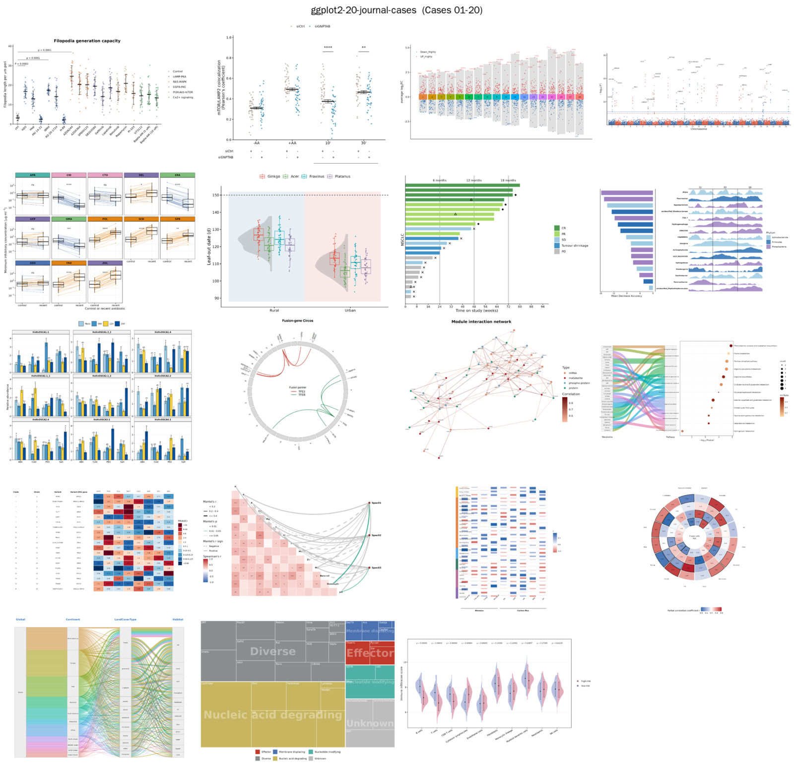

# Approved ggplot2 Plot Cases

This directory contains 20 predefined ggplot2 figure recipes available to the
Data Analysis Agency. Each case includes simulated data for reproducible preview
and testing.



Each case normally contains:

```text
simulate.R   example-data generator
plot.R       figure recipe and agency data bridge
figures/     rendered reference output
```

All plot types can represent real data. Some cases already have a direct
one-table adapter in the agency; others need an additional controlled adapter
for matrices, networks, hierarchies, or multiple linked tables. See the
project's top-level `README.md` for setup and current integration status.

## Plot catalog

| # | Figure type | Typical use |
|---:|---|---|
| 01 | Individualized error dot plot | Compare category means and variability. |
| 02 | Grouped error dot plot | Compare means and uncertainty across two groupings. |
| 03 | Multi-group volcano plot | Show effect sizes across contrasts or groups. |
| 04 | Manhattan/TWAS plot | Show genome-wide signals by chromosome. |
| 05 | Paired boxplot | Compare matched observations or conditions. |
| 06 | Raincloud plot | Combine distributions, summaries, and observations. |
| 07 | Swimmer plot | Show subject timelines, events, and outcomes. |
| 08 | Importance bars and streams | Combine feature importance and changing composition. |
| 09 | Grouped variance bars | Show means, uncertainty, and significance groups. |
| 10 | Circos fusion diagram | Show genomic loci and chromosome links. |
| 11 | Module interaction network | Show modules, nodes, communities, and edges. |
| 12 | Sankey and enrichment panel | Combine category flow and enrichment statistics. |
| 13 | Discrete heatmap | Display categorical or binned matrix values. |
| 14 | Mantel composite heatmap | Combine matrix and Mantel-test relationships. |
| 15 | Multi-group correlation heatmap | Compare correlation structures across groups. |
| 16 | Polar heatmap | Show multivariate values in a radial layout. |
| 17 | Multi-level Sankey | Show weighted flow across three categorical levels. |
| 18 | Treemap | Show hierarchical composition through area. |
| 19 | Mosaic and sunburst | Show hierarchical composition in two layouts. |
| 20 | Split violin | Compare two distributions within each feature. |

The recipe collection is covered by the MIT License stored in this directory.
